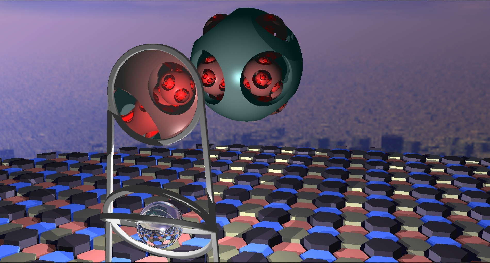
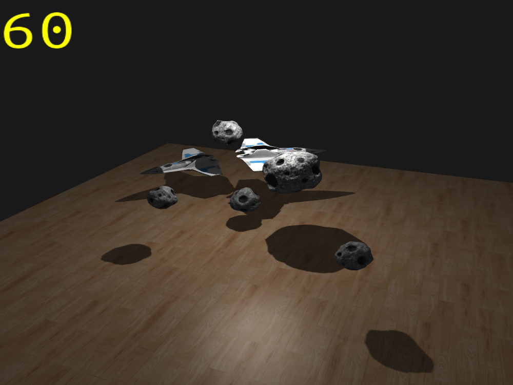
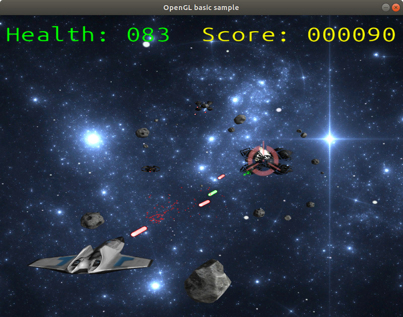

# OpenGL
This repository with my works on course of computer graphic

There are 3 tasks in follow folders:
* rayMarching
* shadowMap
* spaceShooter

Each folder contain screenshots and readme.

You can build applications directly in this folders on Linux with follow commands:
```
mkdir build
cd build
cmake ..
make
```
And then run:
```
./main
```

All models I took from [sketchfab.com](https://sketchfab.com/feed) at follow links:
* https://sketchfab.com/3d-models/asteroid-01-df95d3da67aa4c769ec81394e0b0ffef
* https://sketchfab.com/3d-models/small-rock-2-low-poly-e58c90c578c44826bfe175cec2dfe5c6
* https://sketchfab.com/3d-models/starship-f94fa4e5ae83436a97f0a2ab4c8ad42f
* https://sketchfab.com/3d-models/star-viper-free-705e1a79b48745938e67760c4e3eed65
* https://sketchfab.com/3d-models/free-sci-fi-fighter-dca1c832ee574e2fa2cdaa06515f66a9
* https://sketchfab.com/3d-models/death-row-spaceship-712057c4562d413594beb723f6ec6dd6

Screenshots:



